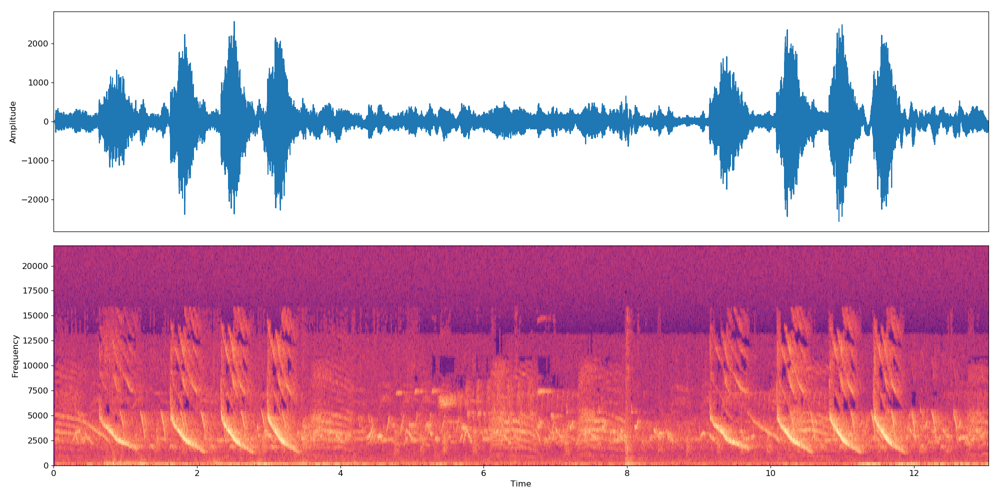

DEEP Open Catalogue: Audio classifier
=======================

[](https://jenkins.indigo-datacloud.eu:8080/job/Pipeline-as-code/job/DEEP-OC-org/job/audioclas/job/master)

**Author/Mantainer:** [Ignacio Heredia](https://github.com/IgnacioHeredia) (CSIC)

**Project:** This work is part of the [DEEP Hybrid-DataCloud](https://deep-hybrid-datacloud.eu/) project that has received funding from the European Union’s Horizon 2020 research and innovation programme under grant agreement No 777435.

This is a plug-and-play tool to perform audio classification with Deep Learning. It allows the user to classify their samples of audio as well as training their own classifier for a custom problem. The classifier is currently [pretrained](models/default) on the 527 high-level classes from the [AudioSet](https://research.google.com/audioset/) dataset.

You can find more information about it in the [DEEP Marketplace](https://marketplace.deep-hybrid-datacloud.eu/).




## Installing this module

### Local installation

**Requirements**
 
- It is a requirement to have [Tensorflow>=1.12.0 installed](https://www.tensorflow.org/install/pip) (either in gpu or cpu mode). This is not listed in the `requirements.txt` as it [breaks GPU support](https://github.com/tensorflow/tensorflow/issues/7166).   
- This project has been tested in Ubuntu 18.04 with Python 3.6.5. Further package requirements are described in the `requirements.txt` file.

To start using this framework run and download the [default weights](https://cephrgw01.ifca.es:8080/swift/v1/audio-classification-tf/default.tar.gz):

```bash
git clone https://github.com/deephdc/audio-classification-tf
cd audio-classification-tf
pip install -e .
curl -o ./models/default.tar.gz https://cephrgw01.ifca.es:8080/swift/v1/audio-classification-tf/default.tar.gz
cd models && tar -zxvf default.tar.gz && rm default.tar.gz 
```

To use this module with an API you have to install the [DEEPaaS](https://github.com/indigo-dc/DEEPaaS) package (temporarily, until `1.0` launching, you will have to use the `test-args` branch):

```bash
git clone -b test-args https://github.com/indigo-dc/deepaas
cd deepaas
pip install -e .
```

and run `deepaas-run --listen-ip 0.0.0.0`. Now open http://0.0.0.0:5000/ and look for the methods belonging to the `audioclas` module.

### Docker installation

We have also prepared a ready-to-use [Docker container](https://github.com/deephdc/DEEP-OC-audio-classification-tf) to run this module. To run it:

```bash
docker search deephdc
docker run -ti -p 5000:5000 deephdc/deep-oc-audio-classification-tf
```

Now open http://0.0.0.0:5000/ and look for the methods belonging to the `audioclas` module.


## Train an audio classifier [in progress :hourglass_flowing_sand:]

You can train your own audio classifier with your custom dataset. For that you have to:


## Test an audio classifier

There are two possible ways to use the `PREDICT` method from the DEEPaaS API:

* supply to the `data` argument a path  pointing to a (signed 16-bit PCM) `wav` file containing your audio.
* supply to the `url` argument an online url  pointing to a (signed 16-bit PCM) `wav` file containing your audio. Here is an [example](https://file-examples.com/wp-content/uploads/2017/11/file_example_WAV_1MG.wav) of such an url that you can use for testing purposes.

## Acknowledgments

The code in this project is based on the [original repo](https://github.com/IBM/MAX-Audio-Classifier) by [IBM](https://github.com/IBM), and implements the paper ['Multi-level Attention Model for Weakly Supervised Audio Classification'](https://arxiv.org/abs/1803.02353) by Yu et al.

The main changes with respect to the original repo are that:

* we have addded a training method so that the user is able to create his own custom classifier
* the code has been packaged into an installable Python package.
* it has been made compatible with the [DEEPaaS API](http://docs.deep-hybrid-datacloud.eu/en/latest/user/overview/api.html).

If you consider this project to be useful, please consider citing any of the references below:

* _Jort F. Gemmeke, Daniel P. W. Ellis, Dylan Freedman, Aren Jansen, Wade Lawrence, R. Channing Moore, Manoj Plakal, Marvin Ritter_,["Audio set: An ontology and human-labeled dataset for audio events"](https://static.googleusercontent.com/media/research.google.com/en//pubs/archive/45857.pdf), IEEE ICASSP, 2017.

* _Qiuqiang Kong, Yong Xu, Wenwu Wang, Mark D. Plumbley_,["Audio Set classification with attention model: A probabilistic perspective."](https://arxiv.org/pdf/1711.00927.pdf) arXiv preprint arXiv:1711.00927 (2017).

* _Changsong Yu, Karim Said Barsim, Qiuqiang Kong, Bin Yang_ ,["Multi-level Attention Model for Weakly Supervised Audio Classification."](https://arxiv.org/pdf/1803.02353.pdf) arXiv preprint arXiv:1803.02353 (2018).

* _S. Hershey, S. Chaudhuri, D. P. W. Ellis, J. F. Gemmeke, A. Jansen,
R. C. Moore, M. Plakal, D. Platt, R. A. Saurous, B. Seybold et  al._,
["CNN architectures for large-scale audio classification,"](https://arxiv.org/pdf/1609.09430.pdf) arXiv preprint
arXiv:1609.09430, 2016.